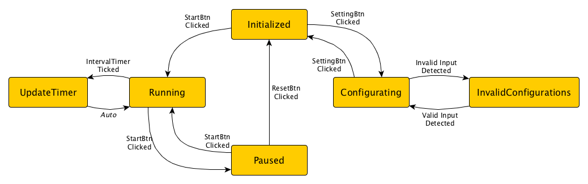

# HIIT Timer powered by KKBOX

This is a purely client-side application, just clone it and open 'index.html' to use the timer ;)

## State Machine

### State Diagram

#### States

* Initialized
* Running
* UpdateTimer
* Paused
* Configurating
* ValidatingInput
* InvalidConfigurations

#### Events

* StartBtnClicked
* SettingBtnClicked
* ResetBtnClicked
* InvervalTimerTicked
* KeyInput (On input fields)
* *Input Validated*
* *Input Invalid Detected*
* *Auto (Automatically triggered)*

Note: Events in italic font are triggered by the state machine itself.

### Views (Display elements)

* Counter
* CounterBackground
* SetsIndicator
* StartBtn
* ResetBtn
* SettingBtn
* InputField
* WarmupInput
* HighInput
* LowInput
* CooldownInput
* SetsInput

### Actions and appearance under each state

#### Initialized

* HiitTimer instance should be reinitialized by the tSpec.

|   | Display | Text/Appearance |
| - | ------- | ---- |
| Counter | Show | Timer value |
| CounterBackground | Show | Yellow |
| SetsIndicator | Show | Sets value |
| StartBtn | Enabled | "Start" |
| ResetBtn | Disabled | "Reset" |
| SettingBtn | Enabled | "Setting" |
| InputField | Hidden | - |
| WarmupInput | - | - |
| HighInput | - | - |
| LowInput | - | - |
| CooldownInput | - | - |
| SetsInput | - | - |

#### Running

* Interval timer should be **enabled**.

|   | Display | Text/Appearance |
| - | ------- | ---- |
| Counter | Show | Timer value |
| CounterBackground | Show | Depends on interval |
| SetsIndicator | Show | Sets value |
| StartBtn | Enabled | "Paused" |
| ResetBtn | Disabled | "Reset" |
| SettingBtn | Disabled | "Setting" |
| InputField | Hidden | - |
| WarmupInput | - | - |
| HighInput | - | - |
| LowInput | - | - |
| CooldownInput | - | - |
| SetsInput | - | - |

#### Paused

* Interval timer should be **disabled**.

|   | Display | Text/Appearance |
| - | ------- | ---- |
| Counter | Show | Timer value |
| CounterBackground | Show | Depends on interval |
| SetsIndicator | Show | Sets value |
| StartBtn | Enabled | "Start" |
| ResetBtn | Enabled | "Reset" |
| SettingBtn | Disabled | "Setting" |
| InputField | Hidden | - |
| WarmupInput | - | - |
| HighInput | - | - |
| LowInput | - | - |
| CooldownInput | - | - |
| SetsInput | - | - |

#### Configurating

|   | Display | Text/Appearance |
| - | ------- | ---- |
| Counter | Show | "--:--" |
| CounterBackground | Show | Yellow |
| SetsIndicator | Show | "--/--" |
| StartBtn | Disabled | "Start" |
| ResetBtn | Disabled | "Reset" |
| SettingBtn | Enabled | "Apply" |
| InputField | Show | - |
| WarmupInput | Show | - |
| HighInput | Show | - |
| LowInput | Show | - |
| CooldownInput | Show | - |
| SetsInput | Show | - |

#### ValidatingInputs

* Validating all the input fields. If any of the inputs is invalid, change its background to red.

* If all inputs are valid, create new HiitTimer instance.

|   | Display | Text/Appearance |
| - | ------- | ---- |
| Counter | Show | "--:--" |
| CounterBackground | Show | Yellow |
| SetsIndicator | Show | "--/--" |
| StartBtn | Disabled | "Start" |
| ResetBtn | Disabled | "Reset" |
| SettingBtn | Disabled | "Apply" |
| InputField | Show | - |
| WarmupInput | Show | Background red if invalid |
| HighInput | Show | Background red if invalid |
| LowInput | Show | Background red if invalid |
| CooldownInput | Show | Background red if invalid |
| SetsInput | Show | Background red if invalid |
